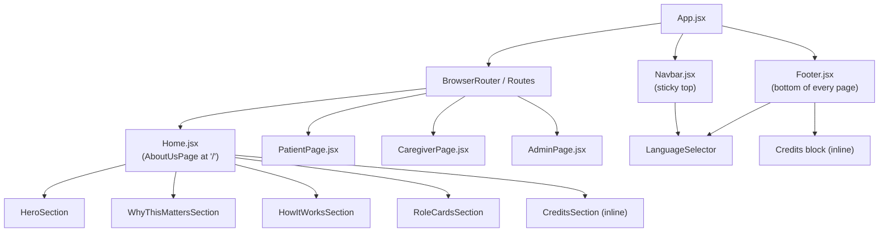

# Design Document: About Us Page

## Overview

The About Us page replaces the current minimal role-selector at `src/pages/Home.jsx` with a fully-featured public landing page for the "Ask Your Doctor" QPL Digital Platform. A shared `Footer` component is also introduced and wired into `App.jsx` so it appears on every route.

The implementation is pure React 18 JSX with Tailwind CSS v3, no external component library. All routing uses `react-router-dom` v7 `<Link>` and `<NavLink>` components. Language selection is managed with local React state only — no i18n library is introduced.

---

## Architecture

```
App.jsx
├── <Navbar />                  (sticky, always visible)
├── <Routes>
│   ├── / → <Home />            (renamed internally to AboutUsPage)
│   ├── /patient → <PatientPage />
│   ├── /caregiver → <CaregiverPage />
│   └── /admin → <AdminPage />
└── <Footer />                  (always visible)
```

The `<Navbar>` and `<Footer>` are lifted into `App.jsx` outside the `<Routes>` block so they render on every page without requiring a layout route.



---

## Components and Interfaces

### `src/components/Navbar.jsx`

Sticky top navigation bar. Manages hamburger open/close state internally.

**Props:** none (all data is static or internal state)

**Internal state:**
- `menuOpen` (boolean) — whether the mobile menu panel is visible
- `selectedLang` (string: `'EN' | 'HI' | 'MR'`) — passed down to or shared with LanguageSelector

**Key elements:**
- Logo/site name linked to `/`
- Desktop nav links: About Us, About QPL (placeholder `#`)
- `<LanguageSelector />` (desktop inline, mobile inside menu)
- "Log In" → `/login`, "Get Started" → `/select-role`
- Hamburger button with `aria-label` and `aria-expanded`
- Mobile slide-down menu panel (conditionally rendered)

### `src/components/Footer.jsx`

Shared footer rendered from `App.jsx`. Dark navy background, white text.

**Props:** none

**Key elements:**
- Nav links: About Us, About QPL, Contact Us, Privacy Policy, Terms of Use
- Credits block with the four academic contributors
- `<LanguageSelector />` (dark-theme variant)
- Copyright line

### `src/components/LanguageSelector.jsx`

Reusable language toggle. Manages selected language in local state.

**Props:**
```jsx
{
  theme: 'light' | 'dark',   // controls text/highlight colours
  // future: onLanguageChange callback
}
```

**Internal state:**
- `selected` (string: `'EN' | 'HI' | 'MR'`, default `'EN'`)

**Behaviour:** clicking/pressing a language label sets `selected`; the active option receives a visible highlight class. No page content changes.

### `src/pages/Home.jsx` (rewritten as AboutUsPage)

Full landing page. Composed entirely of section components or inline JSX. Uses `<main>` wrapper.

**Sections (rendered in order):**
1. HeroSection
2. WhyThisMattersSection
3. HowItWorksSection
4. RoleCardsSection
5. CreditsSection

All sections are inline JSX within `Home.jsx` (no separate files needed given their static nature), keeping the component tree shallow and the file easy to scan.

---

## Data Models

All content on this page is static. No API calls, no state management beyond UI toggles. The data structures are simple constant arrays/objects defined at the top of each component or in a co-located `content.js` file if desired.

```js
// src/pages/Home.jsx — static content constants

const HOW_IT_WORKS_STEPS = [
  { id: 1, label: 'Tell us about you' },
  { id: 2, label: 'Build your question list' },
  { id: 3, label: 'Take it to your doctor' },
]

const ROLE_CARDS = [
  {
    id: 'patient',
    label: "I'm a Patient",
    description: 'Get a personalised list of questions to ask your specialist.',
    href: '/signup?role=patient',
  },
  {
    id: 'caregiver',
    label: "I'm a Caregiver",
    description: 'Support your loved one by preparing questions on their behalf.',
    href: '/signup?role=caregiver',
  },
]

const CONTRIBUTORS = [
  { name: 'Dr Shweta Chawak', institution: 'IIT Hyderabad / Jindal Global University' },
  { name: 'Dr Mahati Chittem', institution: 'IIT Hyderabad' },
  { name: 'Prof Phyllis Butow', institution: 'University of Sydney' },
  { name: 'Dr Haryana Dhillon', institution: 'University of Sydney' },
]

// src/components/LanguageSelector.jsx
const LANGUAGES = ['EN', 'HI', 'MR']
```

---

## Correctness Properties

*A property is a characteristic or behavior that should hold true across all valid executions of a system — essentially, a formal statement about what the system should do. Properties serve as the bridge between human-readable specifications and machine-verifiable correctness guarantees.*

The prework analysis identified the following acceptance criteria as suitable for property-based or structural property testing. After reflection, several properties about rendered content structure are combined, and purely visual/aesthetic criteria are excluded.

**Property Reflection:**
- Properties about "each step has a number/icon" (4.2) and "HowItWorksSection renders exactly 3 steps in order" (4.1) are combined — verifying the steps array covers both.
- Properties about contributor listing in CreditsSection (6.2) and Footer (7.4) are distinct components and kept separate.
- Properties about "each nav link is present in Footer" (7.3) and "Footer contains credits" (7.4) are kept separate as they verify different lists.
- The LanguageSelector selection state property (8.2) and no-translation property (8.3) remain separate as they test different behaviours.

---

### Property 1: HowItWorksSection renders all steps in order

*For any* rendering of the HowItWorksSection component, the output SHALL contain exactly the three step labels — "Tell us about you", "Build your question list", "Take it to your doctor" — in that precise order, each accompanied by a step number or icon.

**Validates: Requirements 4.1, 4.2**

---

### Property 2: Each role card contains required content

*For any* card rendered by the RoleCardsSection, the output SHALL contain both a non-empty label and a non-empty description string.

**Validates: Requirements 5.4**

---

### Property 3: CreditsSection lists all contributors

*For any* rendering of a CreditsSection (whether inside Home or Footer), the output SHALL contain exactly the four contributor names: "Dr Shweta Chawak", "Dr Mahati Chittem", "Prof Phyllis Butow", and "Dr Haryana Dhillon", each paired with their institution.

**Validates: Requirements 6.2, 7.4**

---

### Property 4: Footer contains all required navigation links

*For any* rendering of the Footer component, the output SHALL contain links or elements with the labels "About Us", "About QPL", "Contact Us", "Privacy Policy", and "Terms of Use".

**Validates: Requirements 7.3**

---

### Property 5: LanguageSelector displays all three language options

*For any* rendering of the LanguageSelector component (regardless of `theme` prop), the output SHALL contain exactly three interactive elements labelled "EN", "HI", and "MR".

**Validates: Requirements 8.1**

---

### Property 6: LanguageSelector selection state reflects last user activation

*For any* initial language state, when the user activates any one of the three language options, the selected state SHALL update to that option, and the highlighted option in the rendered output SHALL match the newly selected language.

**Validates: Requirements 8.2**

---

### Property 7: LanguageSelector activation does not alter page text content

*For any* language selection, the visible text content of all non-LanguageSelector elements on the page (headings, paragraphs, button labels) SHALL remain identical before and after the language option is activated.

**Validates: Requirements 8.3**

---

### Property 8: All page sections carry accessible labels

*For any* `<section>` element rendered within the AboutUsPage, the element SHALL have either an `aria-label` or `aria-labelledby` attribute with a non-empty value.

**Validates: Requirements 9.2**

---

### Property 9: All non-decorative icons and images carry accessible labels

*For any* non-decorative `` or icon element rendered on the AboutUsPage or in the Footer, the element SHALL have either a non-empty `alt` attribute or an `aria-label` attribute.

**Validates: Requirements 9.6**

---

## Error Handling

This page is entirely static — there are no API calls, no user-submitted data, and no asynchronous operations. Error handling considerations are:

- **Missing route targets** (`/login`, `/select-role`, `/signup?role=patient`, `/signup?role=caregiver`): These routes do not exist yet. React Router will simply render nothing / a blank page. No error UI is required in this iteration; placeholder routes are explicitly in-scope.
- **LanguageSelector state**: State is local React state; it cannot fail. If the component is remounted, state resets to `'EN'` by default — acceptable for this iteration.
- **Rendering failures**: Standard React error boundaries are not required for this static page, but `App.jsx` may wrap routes in a basic error boundary in a future iteration.

---

## Testing Strategy

### Approach

This feature is a static React UI with no API integration, no complex business logic, and no data transformation. It is not suitable for property-based testing with a PBT library (there are no pure functions over large input spaces). Instead, the correctness properties defined above translate directly into **structural component tests** using a standard test runner.

**Recommended stack:** [Vitest](https://vitest.dev/) + [@testing-library/react](https://testing-library.com/docs/react-testing-library/intro/) + [@testing-library/jest-dom](https://github.com/testing-library/jest-dom). These integrate natively with Vite and are the de-facto standard for React + Vite projects.

### Unit / Component Tests

Unit tests verify specific rendered output and interactions with concrete examples. They are the primary test type for this feature.

**Navbar tests:**
- Renders site name "Ask Your Doctor" with link to `/`
- Renders "Log In" and "Get Started" buttons with correct hrefs
- Renders "About Us" and "About QPL" nav links
- Shows hamburger icon on narrow viewport, hides desktop nav
- Hamburger click opens menu; second click closes it
- `aria-expanded` attribute toggles correctly on hamburger button

**LanguageSelector tests:**
- Renders "EN", "HI", "MR" options (Property 5)
- Clicking "HI" sets it as selected; clicking "EN" restores (Property 6)
- Page text content outside selector is unchanged after language switch (Property 7)
- All options are keyboard-reachable (tabIndex / role check)

**Home (AboutUsPage) tests:**
- Renders headline "Ask Your Doctor" and value proposition text
- Renders "Get Started" and "Log In" buttons with correct hrefs
- "Why This Matters" section is present and contains explanatory text
- HowItWorksSection renders steps in correct order with step indicators (Property 1)
- RoleCardsSection: "I'm a Patient" links to `/signup?role=patient` (Property 2 — label)
- RoleCardsSection: "I'm a Caregiver" links to `/signup?role=caregiver` (Property 2 — label)
- Each role card has non-empty description text (Property 2 — description)
- CreditsSection renders all four contributors with institutions (Property 3)
- Each `<section>` has `aria-label` or `aria-labelledby` (Property 8)
- Non-decorative icons carry `aria-label` (Property 9)
- Semantic landmark elements (`<header>`, `<main>`, `<footer>`) are present

**Footer tests:**
- Renders all five nav links by label (Property 4)
- Renders all four contributors (Property 3 — Footer instance)
- Renders copyright text "© 2025 Ask Your Doctor. All rights reserved."
- Contains LanguageSelector
- Is present on App render (wiring check)

### What is NOT tested

- Actual CSS visual rendering (colour values, layout positions) — these require visual regression tooling outside the current stack
- WCAG contrast ratios — requires manual audit with tools such as axe or Lighthouse
- Responsive layout at specific pixel widths — requires browser-based testing (Playwright/Cypress) not scoped here
- Animation or transition behaviour
