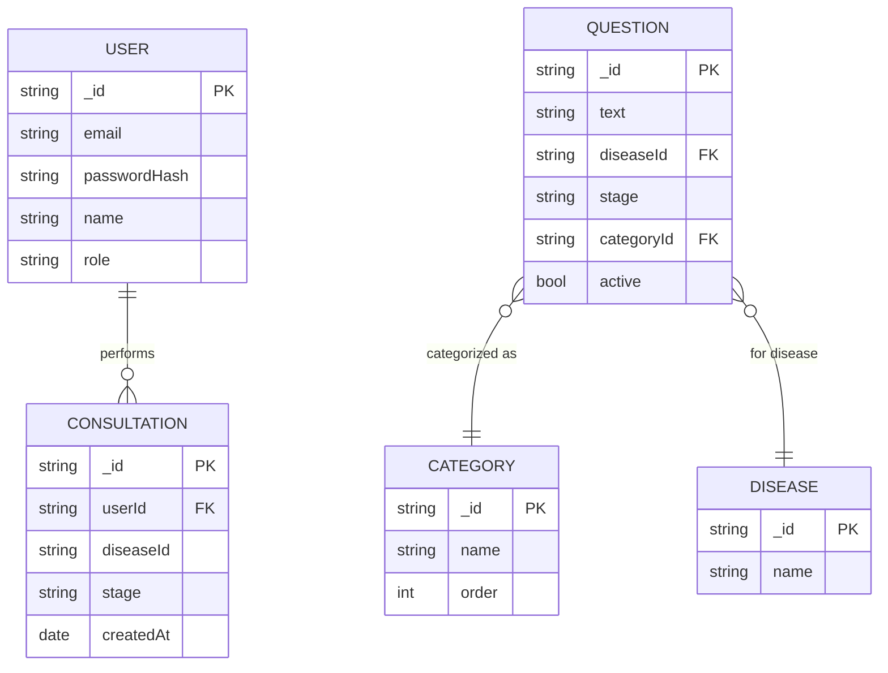
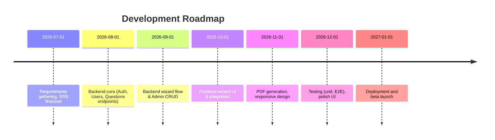

# Executive Summary

This document defines a complete Software Requirements Specification (SRS) and implementation blueprint for a **MERN (MongoDB, Express, React, Node)** web application. The app empowers patients and caregivers to systematically prepare question lists for medical consultations. Key features include a step-by-step **questionnaire wizard** (select disease, stage, question categories, plus custom questions), user authentication (email/password and Google OAuth with JWT), an admin interface for managing question banks, and PDF generation of finalized question lists. The backend uses MongoDB with carefully designed collections to capture immutable snapshots of each consultation session. The frontend is built with React and employs modern libraries – React Query for server state, Zustand for client state, and React Hook Form + Zod for robust form handling – all following best practices. Security measures include HTTPS/TLS, HTTP-only Secure cookies for tokens, input validation, and compliance with data privacy regulations (GDPR/India’s DPDP). A responsive design (mobile + desktop) is used throughout. Testing (Jest/RTL for unit tests, SuperTest for APIs, Cypress for E2E) is planned, and CI/CD with automated builds/tests and containerized deployment is recommended. Diagrams (mermaid) and tables are included below to illustrate entity relationships, API endpoints, data models, UI flows, and project milestones.

Key highlights:
- **Users & Roles:** Patients/caregivers can sign up/login, fill demographics, run questionnaires by disease/stage, review past consultation lists, and download PDFs. Admins can manage the question bank (CRUD) and view user data.
- **Features:** Stepwise wizard UI (disease → stage → category tabs → select questions → pick top-3 → add custom questions → preview & PDF). Admin CRUD, basic dashboards. Responsive UI. No AI/ML; questions are pre-defined.
- **Authentication:** Email/password plus Google OAuth. Short-lived JWT access tokens and long-lived refresh tokens in httpOnly Secure cookies, with CSRF protection. Protected REST endpoints with middleware.
- **Data Model:** Collections include Users, Questions, Categories, Diseases, and Consultations. Consultations embed snapshots of selected questions and answers for immutability. Example documents and indexes are given.
- **APIs:** RESTful JSON endpoints (POST/GET/PUT/DELETE) for auth, users, questions, consultations. Each has request/response schemas, auth requirements, and error codes.
- **Frontend:** Structured React project with folder conventions. Key components (Login, Dashboard, Wizard steps, QuestionList, PDFViewer, Admin pages). State management uses React Query for data fetching and caching, Zustand for UI state. Forms validated via React Hook Form + Zod schemas for type-safe client & server validation.
- **Backend:** Structured Node/Express project (routes, controllers, services, models). Uses middleware for validation, error handling, and logging. Follows best practices: separate concerns, MVC-like layering, config files, and secure coding.
- **PDF Generation:** Server-side generation via Puppeteer (headless Chrome) to render a print-friendly React page to PDF. The server sends the PDF buffer to the client for download.
- **Admin Versioning:** Editing questions creates new versions. Old consultations retain original text (snapshot in Consultation document). 
- **Timeline UI:** Users can view past consultations chronologically (week 1, 2, etc.), click to recall sections/questions asked on that date.
- **Testing & Deployment:** A plan for unit (Jest, Mocha+Chai), integration (SuperTest), and e2e (React Testing Library, Cypress) tests is outlined. CI/CD pipelines (e.g. GitHub Actions) run tests on push and automate deployments (Docker/Heroku/AWS).
- **Security & Privacy:** HTTPS mandatory, tokens secured in cookies, input validation (Zod), data encrypted in transit and at rest, compliance with GDPR/India’s DPDP (informed consent, minimization).

The sections below elaborate each area in detail, with tables, example schemas, sample JSON, and mermaid diagrams for clarity.

## Features and Roles

**Patient/Caregiver Features:**  
- **Onboarding & Profile:** Sign up / log in (email+password or Google OAuth). Fill/edit **demographics** (e.g. name, age, gender, diagnosis date, etc.).  
- **Questionnaire Wizard:** A guided, tabbed flow: *Step 1:* Select diagnosed **disease**. *Step 2:* Select **stage** (Diagnosis, Treatment, Survivorship, Palliative, etc.). *Step 3:* View question categories (Diagnosis, Tests, Treatment, Support, etc.) relevant to chosen disease and stage. *Step 4:* Select any number of questions from each category. *Step 5:* Mark up to **Top-3** questions (highest priority). *Step 6:* Add any number of **custom questions** in a text box. *Step 7:* Preview the organized list of questions. Finally, **Download** as PDF.  
- **Consultation History:** After each session, the “consultation” is saved with date/time. Users see a chronological timeline (latest first). Clicking a date shows the session’s details (disease/stage and full question list).  
- **Responsive UI:** All pages work on desktop and mobile (design from day one to be responsive).  

**Admin Features:**  
- **Authentication:** Admins use same login as users, distinguished by role. Only admin accounts (flagged in user record) can access admin routes.  
- **Dashboard:** Simple admin home (no advanced analytics required). Possibly shows stats (number of users, consultations).  
- **Question Bank Management:** CRUD interfaces to manage question prompts. Questions are tagged by disease, stage, and category. Editing a question creates a new version; existing consultations keep the old text (snapshot).  
- **User Management:** View list of users and their consultation counts (optional).  
- **Content Controls:** Manage disease and category lists (optional if needed; could be seeded data).  

No advanced features (appointments, hospitals, chatbots) are included. This is a prototype focusing on question preparation. 

## User Stories & Acceptance Criteria

We structure requirements as **user stories** (“As a …, I want … so that …”) with accompanying **acceptance criteria** per Atlassian guidelines. Each story below spans a key interaction. Acceptance criteria define “Definition of Done” conditions for each story.

1. **User Account & Profile**  
   - *Story:* As a patient/caregiver, I want to **sign up** (email/password or Google) and complete my **demographics** (name, age, gender, etc.) so that my profile is saved.  
   - *Acceptance:* User can register with valid email/password or Google OAuth. On first login, user is redirected to a Demographics form and **cannot proceed** until mandatory fields are filled. The form validates input (e.g. age must be numeric, email format). Profile data is saved in MongoDB under `Users`. User can later edit demographics (changes are stored).  
   - *Story:* As a user, I want to **log in** securely so that only I can access my data.  
   - *Acceptance:* Login via email/password or Google. On success, client receives a JWT access token and a refresh token (HTTP-only cookie). Protected pages redirect to login if no valid token. Logout invalidates session (access token expires, refresh token revoked).  

2. **Questionnaire Wizard**  
   - *Story:* As a user, I want to start a new consultation by selecting my **disease** and **stage**, so that I see only relevant questions.  
   - *Acceptance:* On “New Consultation”, user first sees a dropdown/list of diseases (e.g. Lung, Breast, Colorectal, etc.). After selecting a disease, a second dropdown asks for **stage** (e.g. Diagnosis, Treatment, Survivorship). Both fields are required. Only valid disease-stage combinations are allowed.  
   - *Story:* As a user, after choosing disease/stage, I want to see question categories and prompts relevant to that context.  
   - *Acceptance:* The app filters the question bank to only those matching the chosen disease and stage. It displays tabs (e.g. Diagnosis, Tests, Treatment, Support) or sections containing relevant questions. Within each tab, questions are listed with checkboxes (user can select multiple). Questions shared across diseases appear under each.  
   - *Story:* As a user, I want to **mark Top-3** questions from my selected set as highest priority, so doctors can focus on them.  
   - *Acceptance:* After selecting questions, user can flag up to three of them as “Top Questions”. The UI should not allow more than 3 top questions; if a fourth is attempted, the app shows an error/informational message. Top questions are visually distinguished.  
   - *Story:* As a user, I want to **add custom questions** (free text) in case I have unique doubts.  
   - *Acceptance:* A text area is available (or multiple fields) for entering any number of custom questions. These are appended to the final list. Custom entries cannot be empty strings.  
   - *Story:* As a user, I want to **preview** and **download** the final question list as a PDF.  
   - *Acceptance:* On the final step, the app displays all selected questions (including top flags and custom ones). A “Download PDF” button triggers generation of a PDF (server-side) which the user can save. The PDF accurately lists questions in selected order, highlights top-3 (e.g. with a ★), and includes a timestamp and basic user info. The PDF rendering must match the on-screen preview.  

3. **Consultation History & Timeline**  
   - *Story:* As a user, I want to see a history of all my consultations in reverse chronological order, so I can revisit past questions.  
   - *Acceptance:* The “My Consultations” page shows a list (or timeline) of sessions by date. Each entry shows date and stage (e.g. “Breast Cancer – Diagnosis (2026-06-15)”). Clicking an entry opens a detailed view of that session’s questions exactly as answered (immutable snapshot). The list updates as new sessions are added. No limit on number of sessions; the list scrolls or paginates if needed.  

4. **Admin: Question Bank Management**  
   - *Story:* As an admin, I want to create new question prompts with disease, stage, and category tags, so that the question bank can grow.  
   - *Acceptance:* The admin UI has a “Create Question” form with fields: *Text*, *Disease*, *Stage*, *Category*, *Active (yes/no)*. All are required. Upon saving, the question is stored in the `Questions` collection. The app enforces uniqueness (or allows duplicates with same text?). The new question appears for users in the appropriate filters.  
   - *Story:* As an admin, I want to **edit** an existing question’s text or tags. Changes should not alter past consultations.  
   - *Acceptance:* The admin can edit a question’s text, disease, stage, and category. The system may version questions: instead of overwriting, the backend can create a new version (for example, by appending version metadata or creating a new document), ensuring old sessions keep the original text. For simplicity, we store the updated text in the same document but **Consultation** snapshots remain unchanged because they embedded the old text at creation. (Implementation notes: when saving consultations, copy question text into the session record.)  
   - *Story:* As an admin, I want to view a list of all questions and delete or deactivate any that are obsolete.  
   - *Acceptance:* Admin UI shows a table of all questions (with disease, stage, category). Admin can delete a question (marking it inactive or removing it). If a question is deleted, existing consultation snapshots remain unchanged; deleted questions simply do not appear for future users.  

5. **General Requirements**  
   - *Story:* As any user, I want the app to be **responsive** so it works on desktop and mobile.  
   - *Acceptance:* The layout adapts to various screen sizes. On desktop, tabs and forms are wide; on mobile, use stacked layout. No element is unreadable or unusable on common phone sizes. Use CSS frameworks (e.g. Tailwind) or media queries to enforce breakpoints (e.g. mobile: <640px, tablet: 640–1024px, desktop: >1024px).  
   - *Story:* As a user, I expect proper **validation and feedback** in forms (no missing fields, format checks).  
   - *Acceptance:* All forms (signup/login, demographics, question selection) validate inputs. Required fields are marked. Validation errors are shown inline (e.g. “Age must be a number”). The “Next” button in the wizard is disabled until required fields are valid.  
   - *Story:* As a developer, I need clear API behavior with error codes so we can handle failures gracefully.  
   - *Acceptance:* All API endpoints return appropriate HTTP status codes: 200 for success, 201 for created, 400 for bad input, 401/403 for auth errors, 404 for not found, 500 for server errors, etc. Error responses include a JSON `{ error: "...message..." }`. Authentication-protected routes return 401 if no/invalid token.

## UI Screen Map & Wireframes

Below is an outline of the main UI pages/screens with their key elements (desktop and mobile layouts):

- **Landing / Welcome Page:**  
  *Elements:* Branding (app name, tagline), brief description of purpose, “Sign Up” / “Log In” buttons (calls-to-action). Optionally language selector. Footer with links (Privacy).  
  *Layout:* Centered callouts; on mobile, stacked vertically with large buttons.  

- **Authentication Pages:**  
  - **Sign Up:** Form with fields *Name, Email, Password, Confirm Password*. “Or sign up with Google” button. Basic password rules text. Submit → create user.  
  - **Login:** Fields *Email, Password*. “Login with Google” button (Google OAuth redirect). “Forgot Password” link (future feature, optional).  
  *Layout:* Simple centered form box, responsive width (max ~400px).

- **Demographics / Profile:**  
  *Elements:* Form fields such as Name, Age/Date of Birth, Gender (radio/select), Primary Language, Contact Info (optional), and maybe Checkboxes (e.g. have you finished treatment?). “Save” button.  
  *Layout:* Two-column on desktop (labels left, inputs right), single-column on mobile. Clear labels and placeholders.  

- **Dashboard / Home:**  
  *Elements:* Personalized greeting (“Welcome, [Name]!”). Buttons/links: “Start New Consultation”, “My Consultations”, “Edit Profile”, “Log Out”. (Admin users also see “Admin Dashboard”.) Possibly quick stats (number of past sessions).  
  *Layout:* Grid of option cards/buttons. Responsive stacking on mobile.  

- **New Consultation Wizard:** (multi-step form)  
  Steps (with breadcrumb or progress bar at top):  
    1. **Select Diagnosis:** Dropdown or list of diseases. *Next* button enabled after selection.  
    2. **Select Stage:** Buttons or dropdown for stage (Diagnosis/Treatment/Survivorship/Palliative).  
    3. **Question Categories:** Tabs (Diagnosis, Tests, Treatment, Emotional, etc.) or accordion. Each tab shows a list of checkboxes for questions. “Select questions relevant to you.” Already-checked boxes from previous sessions (if revisiting same stage)? (Not required for MVP.) *Next* button disabled until at least one question is selected.  
    4. **Top Questions:** Show list of selected questions with option to mark top-3 (e.g. star icon toggles). Prevent marking more than 3 (show count/limit). *Next* continues automatically or with button.  
    5. **Custom Questions:** A text area labeled “Add any other questions you have”. User can add multiple lines or multiple fields.  
    6. **Review & Download:** Display final list grouped by category, highlighting top questions. “Download PDF” button triggers PDF creation. Possibly a “Back” button to edit selections.  

  *Layout:* On desktop, use multi-column or clear sections. On mobile, each step is full-screen, one section at a time. Navigation via “Next”/“Back” and step indicators.

- **Consultation List (History):**  
  *Elements:* A chronological list (newest first) of session entries. Each entry shows: *Date, Disease, Stage, possibly an excerpt of questions or status*. Clicking opens session details.  
  *Layout:* A vertical list. On desktop, could be two-column (list on left, preview on right when selected). On mobile, full list with click-through.

- **Consultation Details:**  
  *Elements:* Header with disease, stage, date. Underneath, list all questions from that session (including custom). Top-3 are marked. Possibly grouped by category heading. A “Download PDF” button if user didn’t previously download.  
  *Layout:* Single-column scroll. Clear headings.

- **Admin Dashboard:**  
  *Elements:* Simple landing for admin. Cards/links: “Manage Questions”, “Manage Users”, “View Consultations” (optional). Stats like total users, total sessions can be shown.  
  *Layout:* Tiles or list links.

- **Admin – Question Management:**  
  *Elements:* Table of questions showing [Text, Disease, Stage, Category, Active/Inactive, Edit, Delete]. A button “Create New Question”. Pagination if many questions.  
  *Layout:* Standard responsive table (stack cells on mobile).

- **Admin – Create/Edit Question Page:**  
  *Elements:* Form fields: Question Text (textarea), Disease (dropdown), Stage (dropdown), Category (dropdown), Active (toggle). “Save” and “Cancel” buttons.  
  *Layout:* Form, straightforward.

- **Admin – User List:**  
  *Elements:* Table of users [Name, Email, Role, #Consultations, Edit/Deactivate].  
  *Layout:* Responsive table.

*(Each page should include navigation (top bar) with menu items and logout option, with distinct color scheme to differentiate user vs admin pages.)*

## Wizard Flow: Step-by-Step

The core **step-by-step flow** (wizard) for creating a question list is as follows:

1. **Disease Selection**  
   - User chooses the diagnosed disease from a list (e.g. dropdown or icons).  
   - *Backend:* Filter question-bank queries by selected disease.

2. **Stage Selection**  
   - User chooses the current stage (Diagnosis, Treatment, etc.).  
   - *Backend:* Filter questions further by stage.

3. **Question Categories**  
   - UI shows tabs or sections labeled by category (Diagnosis, Tests, Treatment, etc.). Only categories relevant to this disease (as defined in seed data) are shown.  
   - Each category tab lists questions (with checkboxes). All matching questions from the `Questions` collection are displayed.  
   - *User action:* Select any checkboxes (can select from multiple categories).  
   - *Constraint:* Must select at least one question to proceed.

4. **Top-3 Selection**  
   - UI lists all questions the user selected in previous step. Next to each question is a star or priority icon.  
   - *User action:* Click up to three questions to mark as top priority (fills the star).  
   - *Validation:* If a fourth is attempted, show an alert like “Only 3 top questions allowed.”  

5. **Custom Questions**  
   - UI provides an input for custom questions (e.g. a text area with an “Add” button to add more).  
   - *User action:* Type any additional questions in free text. Each is added to list.  
   - *Behavior:* These custom items are appended to final session. They do not come from DB.  

6. **Review & Export**  
   - The final page shows a summary: categories with selected questions listed under each, with top ones highlighted, then custom questions.  
   - “Download PDF” button triggers call to backend PDF API.  
   - *After download:* The session is saved to the database (see Data Model), capturing the chosen questions (including storing text) and metadata (userId, date, stage, etc.).  

At each step, “Back” and “Next” (or “Finish”) buttons allow navigation. The UI should prevent skipping required steps (e.g. cannot skip disease). Progress indicators (e.g. step numbers) help orientation. The flow must be intuitive and speedy – ideally one page per step, not too much scrolling.

## Data Model (MongoDB Collections)

We use MongoDB for all data. Key collections:

| **Collection**   | **Fields**                                                                                 | **Indexes**                                | **Example Document**                                                                         |
|------------------|--------------------------------------------------------------------------------------------|--------------------------------------------|----------------------------------------------------------------------------------------------|
| **Users**        | `_id` (ObjectId, PK), `email` (string, unique), `passwordHash` (string), `name` (string), `role` (string: `patient` or `admin`), `demographics` (obj: age, gender, etc.), `language` (string), `createdAt`, `updatedAt`.  | Unique index on `email`. Index on `role`.   | `{_id:"...17", email:"a@b.com", passwordHash:"$2b$...", name:"Alice", role:"patient", demographics:{age:45, gender:"F"}, language:"en", createdAt:..., updatedAt:...}`  |
| **Questions**    | `_id` (ObjectId), `text` (string), `diseaseId` (FK to Diseases/_id), `stage` (string), `categoryId` (FK to Categories/_id), `active` (bool), `createdAt`, `updatedAt`.  | Index on `{diseaseId, stage}`.            | `{_id:"...23", text:"What tests confirm my diagnosis?", diseaseId:"BR", stage:"Diagnosis", categoryId:"cat_diagnosis", active:true, createdAt:...}` |
| **Categories**   | `_id` (ObjectId), `name` (string, e.g. "Diagnosis Questions"), `order` (int).                | Unique index on `name`.                    | `{_id:"cat_diagnosis", name:"Diagnosis", order:1}`                                         |
| **Diseases**     | `_id` (string or ObjectId), `name` (string, e.g. "Breast Cancer").                           | Unique index on `name`.                    | `{_id:"BR", name:"Breast Cancer"}`                                                          |
| **Consultations**| `_id` (ObjectId), `userId` (FK to Users), `diseaseId`, `stage`, `questions` (array of objects: `{questionId, text, categoryId, isTop:boolean}`), `customQuestions` (array of strings), `createdAt`.  | Index on `userId`.                          | `{_id:"...31", userId:"user17", diseaseId:"BR", stage:"Diagnosis", questions:[{questionId:"...23", text:"What tests confirm...", categoryId:"cat_diagnosis", isTop:true}, …], customQuestions:["What about diet?"], createdAt:"2026-06-30T14:00Z"}` |

- **Users:** Stores each user’s login and profile. `role` is “patient” (or “caregiver” synonym) for regular users, and “admin” for administrators. 
- **Questions:** Master question bank. Each doc is one prompt text with tags. If a question is edited, we may create a new doc with updated text (keeping old consultations intact) or update in place knowing snapshots store text. For simplicity, we update in place but ensure consultation docs copy `text` at creation.
- **Categories:** Defines grouping of questions (like “Diagnosis”, “Treatment”, etc.).
- **Diseases:** List of supported diseases. (`id` could be string code or ObjectId; using short string codes (e.g. "BR" for Breast) may help).
- **Consultations:** Each time a user finishes a wizard, a Consultation doc is created. It contains **copies** of the question texts and metadata, not just references, to preserve an immutable record. This is effectively a snapshot of the session. The `questions` array stores the chosen questions (with `text` and if they were marked top), so if the question bank changes later, old consults are unchanged. We also store `diseaseId` and `stage` again for easier querying.

The ER diagram below illustrates relations:



*Notes:* In the diagram, a **USER** can have many **CONSULTATION**s (one-to-many). A **QUESTION** belongs to one **CATEGORY** and one **DISEASE** (each category/disease has many questions). For simplicity, we did not explicitly show the `questionId` to `Consultation` relation here, but in practice each Consultation embeds selected questions.

## API Specification (REST Endpoints)

All APIs use JSON over HTTPS. Below is a table of key endpoints, their methods, authentication requirements, and example request/response schemas. Errors return `{ error: "message" }` with appropriate HTTP status.

| Endpoint                        | Method   | Auth Required | Request Body (JSON)                             | Success Response (JSON)                                                         | Error Codes       |
|---------------------------------|----------|---------------|-------------------------------------------------|---------------------------------------------------------------------------------|-------------------|
| **POST /auth/signup**           | POST     | No            | `{ email, password, name }`                      | `{ userId, name, token, refreshToken }`                                         | 400 (bad input), 409 (email exists) |
| **POST /auth/login**            | POST     | No            | `{ email, password }`                           | `{ userId, name, token, refreshToken }`                                         | 400, 401           |
| **GET /auth/google**            | GET      | No            | *n/a* (redirect to Google OAuth)                | Redirects to Google consent page.                                              | —                 |
| **GET /auth/google/callback**   | GET      | No            | *query params from Google (code, state)*        | `{ userId, name, token, refreshToken }` (and redirect)                          | 401 (if auth fails) |
| **POST /auth/logout**           | POST     | Yes (Refresh Cookie) | None                                     | `{ success: true }`                                                            | 401 (if no token)  |
| **POST /auth/refresh**          | POST     | Yes (Refresh Cookie) | None                                     | `{ token, refreshToken }`                                                      | 401 (invalid/expired) |
| **GET /users/me**              | GET      | Yes (Bearer token)   | None                                     | `{ userId, email, name, demographics, language }`                              | 401                |
| **PATCH /users/me**            | PATCH    | Yes                 | `{ name?, demographics?, language? }`          | `{ userId, ...updatedFields }`                                                | 400 (bad input)    |
| **GET /questions**             | GET      | Yes                 | Query params: `?disease=<id>&stage=<stage>`    | `[{ questionId, text, categoryId, isActive }]`                                  | 400                |
| **POST /consultations**        | POST     | Yes                 | `{ diseaseId, stage, questions: [{questionId,isTop}], customQuestions:[string] }` | `{ consultationId, createdAt }`                   | 400                |
| **GET /consultations**         | GET      | Yes                 | *n/a*                                            | `[{ consultationId, diseaseId, stage, createdAt, topCount, questionCount }]`    | —                 |
| **GET /consultations/:id**     | GET      | Yes                 | *n/a*                                            | `{ consultationId, diseaseId, stage, createdAt, questions:[{text,isTop,categoryId}], customQuestions:[...] }` | 404 if not found  |
| **GET /consultations/:id/pdf** | GET      | Yes                 | *n/a*                                            | Binary PDF data (download attachment)                                          | 404                |
| **GET /admin/questions**       | GET      | Yes (admin only)    | *n/a*                                            | `[{ questionId, text, diseaseId, stage, categoryId, active }]`                 | 403 if not admin  |
| **POST /admin/questions**      | POST     | Yes (admin only)    | `{ text, diseaseId, stage, categoryId, active }` | `{ questionId, createdAt }`                                                   | 400                |
| **PUT /admin/questions/:id**   | PUT      | Yes (admin only)    | `{ text?, diseaseId?, stage?, categoryId?, active? }` | `{ questionId, ...updatedFields }`                                        | 400,404           |
| **DELETE /admin/questions/:id**| DELETE   | Yes (admin only)    | *n/a*                                            | `{ success: true }`                                                          | 404                |
| **GET /admin/users**           | GET      | Yes (admin only)    | *n/a*                                            | `[{ userId, email, name, role, consultationCount }]`                           | 403                |

- **Authentication Endpoints:** `/auth/signup`, `/auth/login`, `/auth/logout`, `/auth/refresh`. Use HTTPS-only cookies for refresh tokens. On login/signup, server issues a **short-lived JWT** (15–30 min) and a **refresh token** (longer, days) per security best practices. The access token goes in the JSON response (client stores it in memory or React Query cache) and the refresh token is in an `HttpOnly, Secure` cookie. Protected routes require `Authorization: Bearer <token>`. `/auth/refresh` reads the refresh cookie, validates it, and issues a new access token (and optionally rotated refresh token). `/auth/logout` clears the refresh cookie server-side.  

- **User Endpoints:** `/users/me` (GET/PATCH) for profile. No admin can create user accounts directly (they come from signup).  
- **Questions Endpoint:** `/questions` (GET) is used by clients (patients). It takes query params for `diseaseId` and `stage` (both required) and returns all active questions matching those filters. Response is a list of question objects. We might also allow optional filtering by category.  
- **Consultation Endpoints:** `/consultations` (POST) saves a session. Request includes diseaseId, stage, an array of selected questions (by ID and `isTop` boolean), and custom questions. The server stores a **snapshot**: it fetches each question’s text from DB and includes it in the new `Consultation` document (this makes the session immutable). Response includes the new session ID and timestamp. `/consultations` (GET) returns a list summary of the user’s sessions (id, date, stage, etc.). `/consultations/:id` (GET) returns full detail (questions text, flags, etc.) for that session. `/consultations/:id/pdf` streams a PDF (Content-Type: application/pdf) generated by Puppeteer; the frontend triggers download.  

- **Admin Endpoints:** Prefixed with `/admin/` or guarded by role checks. Includes CRUD on `/admin/questions` (see table). Admin-only status (403 if normal user). Similar patterns for users. These endpoints follow the same REST conventions (400 for invalid data, 404 if item not found).

*Error Handling:* All endpoints validate input. Invalid parameters yield 400 with an error message. Authentication failure yields 401, and forbidden (wrong role) 403. Server errors return 500. Consistency in error format (a JSON with `error` field) aids frontend handling.

## Authentication Flow

We implement a secure JWT-based auth flow combined with Google OAuth for signup/login. Best practices are followed:

1. **Signup (Email/Password):** User submits email & password. Backend uses bcrypt to hash the password. Store `{ email, passwordHash, name, role: "patient" }`. Return a signed JWT (access token) and a refresh token in an HttpOnly cookie.

2. **Login (Email/Password):** Verify credentials. On success, issue JWT & refresh token. The refresh token is saved as an HTTP-only, Secure cookie (with `SameSite=Strict` or `Lax`). Do *not* expose tokens to JavaScript (mitigating XSS).

3. **Google OAuth:** For users choosing Google, redirect to Google’s OAuth 2.0 consent. On callback (`/auth/google/callback`), verify code, get user profile (Google provides email). If user exists, log them in; otherwise create a new user. Then issue JWT & refresh as above. We use a library or Google’s Node.js client as recommended.

4. **Access Tokens:** Short-lived (15–30 min) JWTs with minimal claims (userId, name, role). Stored in React app state (or memory) and sent in `Authorization` header for protected API calls. After expiry, client automatically calls `/auth/refresh`.

5. **Refresh Tokens:** Long-lived (e.g. 7 days) JWT stored only in the httpOnly cookie. Each use of refresh endpoint could optionally rotate the token (issue a new one and invalidate old) for extra security. The server should track invalidated tokens (e.g. in Redis) if robust security needed. On logout or token expiry, cookie is cleared.

6. **Route Protection:** Express middleware checks `Authorization` header for valid JWT (verify signature, expiry). If invalid or missing, respond 401. Also a middleware checks user’s role (`req.user.role`) for admin routes.  
   
7. **Secure Practices:** Use HTTPS/TLS for all traffic. Cookies are flagged Secure to send only over HTTPS, and HttpOnly to block JS access. Implement CSRF tokens or double-submit cookies since we use cookies for refresh. For example, front-end may include a custom header or CSRF token to `/auth/refresh` as recommended. Rate-limit login and token endpoints to mitigate brute-force. Use strong JWT secrets from env vars.  

Following these steps ensures a secure auth flow consistent with industry best practices. 

## Frontend Architecture

The React frontend follows a modular, layered architecture:

- **Folder Structure:**  
  - `/src/components`: Reusable presentational components (e.g. `<Button>`, `<Input>`, `<QuestionList>`, etc.).  
  - `/src/pages`: Page components for each screen (LoginPage, DashboardPage, WizardPage, AdminUsersPage, etc.).  
  - `/src/features`: Domain-specific components and hooks (e.g. `features/auth/`, `features/questions/`).  
  - `/src/app`: App-wide setup (App.tsx, routing, theme).  
  - `/src/api`: API functions using React Query hooks or generic fetch calls (e.g. `useAuthAPI`, `useConsultationAPI`).  
  - `/src/store`: Zustand stores for client state (e.g. UI state for wizard progress, modal dialogs).  
  - `/src/validation`: Zod schemas for form validation.  
  - `/src/utils`: Utilities (date formatting, constants).  

- **State Management:**  
  We split state into **server state** (data from backend) and **client state**. Server state (users, consultations, questions) is managed by **React Query** (TanStack Query) which provides caching, background refresh, and error handling. For example, queries like `useQuery(['questions', diseaseId, stage], fetchQuestions)` fetch question lists.  
  Client-only UI state (like current wizard step, selected answers) is managed by **Zustand** stores. This avoids prop drilling and keeps components simple. For instance, a `useWizardStore` holds `{ currentStep, selectedQuestions, topQuestions, customQuestions }`. The combination of React Query (for async data) and Zustand (for sync UI state) is a proven approach.

- **Key Components:**  
  - **Auth Components:** `<LoginForm>`, `<GoogleSignInButton>`, `<ProtectedRoute>` wrapper.  
  - **Wizard Steps:** `<DiseaseSelector>`, `<StageSelector>`, `<CategoryTabs>`, `<QuestionPicker>`, `<TopQuestionsSelector>`, `<CustomQuestionsForm>`, `<Review>` etc. Each step is a component inside a parent `<Wizard>` that handles navigation.  
  - **Forms:** Use **React Hook Form** for handling inputs (integrated with Zod for schema validation). For example, the Demographics form uses a Zod schema to enforce types, and RHF’s `useForm({ resolver: zodResolver(demoSchema) })`. This ties in frontend validation seamlessly with backend (we can reuse Zod schemas on the server too).  
  - **Admin Components:** `<QuestionTable>`, `<QuestionForm>`, `<UserTable>`, etc.  
  - **UI Framework:** Tailwind CSS or Chakra UI for responsive styling. Layout components (e.g. `<Container>`, `<Grid>`) ensure mobile-first design. Use a consistent theme/colors.  

- **Navigation:** React Router for client-side routes: e.g. `/login`, `/dashboard`, `/wizard`, `/consultations`, `/admin/users`, `/admin/questions`. `<ProtectedRoute>` checks token and role to grant access.  

- **Data Fetching:** All data calls go through custom hooks that wrap React Query. For example:  
  ```ts
  function useQuestions(diseaseId, stage) {
    return useQuery(['questions', diseaseId, stage], () => 
      axios.get(`/questions?disease=${diseaseId}&stage=${stage}`));
  }
  ```  
  React Query handles loading and error states, which we show via spinners or error banners.

This architecture separates concerns (UI vs data) and leverages type-safe validation. By combining React Query and Zustand, we follow a modern pattern where server data and client state do not conflict.

## Backend Architecture

The Node.js/Express backend follows a modular, layered structure as recommended in Node best practices:

- **Folder Structure:**  
  - `/controllers`: Express route handler functions (one file per resource, e.g. `authController.js`, `questionController.js`). Controllers parse requests and delegate to services.  
  - `/services`: Business logic and DB operations. Each service (e.g. `questionService`) performs queries or updates with MongoDB (via Mongoose or native driver). Keeps controllers thin and stateless.  
  - `/models`: Mongoose schemas/models for each collection (`User`, `Question`, `Consultation`, etc.). These define schema types and use Zod or Mongoose validation for data integrity.  
  - `/routes`: Express routers organizing endpoints (e.g. `authRoutes.js`, `userRoutes.js`, `adminRoutes.js`). Each router uses controllers.  
  - `/middleware`: Custom middleware for authentication (`authMiddleware` verifies JWT), error handling (`errorHandler` catches thrown errors), validation (e.g. `validateBody(schema)`).  
  - `/config`: Configuration (e.g. reading `process.env`, connecting to MongoDB URI).  
  - `/utils`: Helper functions (JWT sign/verify, logging, etc.).  
  - `app.js` / `server.js`: App initialization (apply middleware like helmet, CORS, body-parser), mount routes, start HTTP server.  

- **Validation:** We use Zod on the backend as well to validate request bodies (mirroring frontend schemas). For instance, an Express middleware might `await schema.parseAsync(req.body)` to reject invalid input. This ensures consistent validation rules.

- **Error Handling:** All controllers `throw` errors or call `next(err)`. A global `errorHandler` middleware logs the error (with a logging library like Winston or Pino for structured logs) and sends a JSON error response without leaking sensitive info.  Validation errors return 400. Uncaught exceptions are logged and return 500.

- **Security:** In addition to helmet (see Security section), code uses `cors` to control origins, `express-rate-limit` to throttle auth endpoints, and no sensitive data in logs. We never `console.log` secrets. Configuration (JWT secret, Google OAuth client ID/secret, DB URI) come from environment variables (12-factor app practice).  

- **Database Layer:** Mongoose ODM (or MongoDB Native Driver) is used for schema enforcement. Connection is initialized once. Models include appropriate indexes (`email` unique, etc.) as in data model. All queries are parameterized (no string concatenation) to avoid injection (though MongoDB injection is mostly prevented by using Mongoose with built-in safety).  

- **Documentation:** API routes and schemas can be documented via OpenAPI/Swagger (optional) for clarity. This helps clients and testing.

- **Logging:** Use a logger (e.g. Pino, Winston) with structured JSON logs. Log each request (method, path, user), errors with stack traces, and other events (user signups, admin actions). This follows the principle of structured logging vs `console.log`.

This backend design adheres to Node.js best practices: separation of concerns, security, and readiness for scaling.

## PDF Generation Approach

To generate the downloadable PDF of questions, we use **server-side rendering with Puppeteer**. The flow is:

1. Frontend sends a request (GET `/consultations/:id/pdf`) after saving a consultation. The server handler for this route triggers PDF creation.
2. **Puppeteer** is launched in headless Chrome mode. We load a special “print view” URL of our app. For example, `page.goto('https://our-app.com/print-view?sessionId=...', { waitUntil: 'networkidle0' })`. This route renders a React component (server or client) that displays the consultation data in a print-friendly layout (minimal UI). We ensure no login is needed for this protected route (server injects data or session cookie might suffice).
3. Once loaded, call `page.pdf({ format: 'A4', printBackground: true })`. This yields a Buffer of PDF bytes. We close the browser instance.  
4. The server responds with HTTP `Content-Type: application/pdf` and the PDF buffer, setting `Content-Disposition: attachment; filename="questions_{date}.pdf"`. The frontend, which made the request via `fetch` or Axios (with `responseType: 'arraybuffer'`), then triggers a download for the user.

*Why Puppeteer:* It can accurately render modern CSS/SVG from our React components. As risingstack notes, server-side PDF is preferable for heavy styled pages and keeps the browser workload minimal. We avoid brittle solutions like client-side canvas screenshots (e.g. html2canvas) or complex PDF libraries. Puppeteer handles HTML with full CSS (even page breaks) and can be run in Docker with Chrome (beware of adding `--disable-dev-shm-usage` if using Alpine as per docs).

The PDF template (React component) can hide navigation and buttons via CSS (`@media print` rules or dynamic props). We simply render questions and headings. The sample template includes: Title (“My Consultation Questions”), date, user name, and lists questions (with an asterisk or bullet for top questions and a separate list for custom questions). It’s styled for clarity. 

This approach mirrors proven implementations: RisingStack’s guide explains how to automate PDF via Puppeteer and send it to client. 

## Seed Data Strategy (Question Bank)

We will preload the database with a **question bank** mapping diseases, stages, and categories. This can be done via a seed script (`scripts/seedQuestions.js`) or during initial deployment. The strategy:

- Prepare a JSON/CSV of questions (perhaps from clinical sources or expert input). Each record includes: `text`, `disease`, `stage`, `category`.  
- On startup (or with a CLI command), iterate these records: if a question (text+disease+stage) does not exist, insert it into `Questions`; else skip or update if needed.  
- Diseases and Categories collections should also be seeded with allowed values (“Breast Cancer”, “Lung Cancer”, etc.; categories “Diagnosis”, “Treatment”, etc.).  
- Stages can be an enum array in code (Diagnosis, Treatment, Survivorship, Palliative). No DB needed, but if we want to allow admin to manage them, we could have a small `Stages` collection similarly.

This ensures the app has initial content. Admins can later use the web UI to refine the questions. Example seed document in Mongo:  
```json
{ "text": "What are the side effects of treatment?", "diseaseId":"BR", "stage":"Treatment", "categoryId":"cat_treatment", "active":true }
```
The seed script will use mongoose or direct insertMany and handle indexing.

## Admin CRUD & Versioning

When an admin edits a question, we must preserve past consultation records. Our plan:

- **Edit Behavior:** Editing in-place (simply updating the `Questions` document) is acceptable only if we **snapshot** question text into each Consultation at creation time (which we do). In this model, updating `Questions.text` will not retroactively change old consultations. We just ensure consultation docs contain the `text` field of each selected question at the time of creation. This keeps past sessions immutable.  
- Optionally, we can implement a versioning system (e.g. a `versions` array in `Questions` or a separate `QuestionHistory` collection). But for simplicity, embedding snapshots suffices.  
- **Delete Behavior:** Admin “delete” can either mark a question inactive or remove it. If `active = false`, the question no longer appears in filters. Deleting from `Questions` entirely should be done carefully; better to soft-delete. Past consults with that question still show the text (from snapshot).

## Multi-Consultation Timeline UI

On the user’s home page, we include a timeline of past consultations. This can be a simple vertical list sorted by date (latest first). Each entry shows:
- **Date & Stage:** e.g. “2026-06-01 – Breast Cancer (Treatment)”.  
- **Click to View:** Each entry is clickable. Upon clicking, the page displays that session’s questions (could reuse the Consultation Details component).  
- **UI Behavior:** The timeline could be a side panel or accordion. For mobile, a simple list where tapping expands details or navigates to details page.

No advanced scheduling feature (like upcoming appointment) is included – just recall of past Q&As.

## Responsive Design Guidelines

We follow **mobile-first, responsive design** throughout:

- Use flexible layouts (CSS Grid or Flexbox) and percentage or `rem` units.  
- Employ CSS media queries or a utility framework (Tailwind) to adjust at breakpoints:  
  - **Mobile** (<640px): Single-column layouts, full-width buttons, readable font sizes. Navigation collapses into a hamburger.  
  - **Tablet** (640–1024px): Two-column layouts for forms, moderate padding.  
  - **Desktop** (>1024px): Multi-column or sidebar layouts where appropriate.  
- All interactive elements (buttons, links) are large enough for touch.  
- Use aria-labels and semantic HTML for accessibility (WCAG).  
- Ensure color contrast meets AA standards.  
- Prioritize performance (avoid large images).  

By planning responsiveness from day one, the app will function well across devices, improving user experience and compliance with best practices.

## Testing Plan

A comprehensive testing strategy covers unit, integration, and end-to-end (E2E) tests as recommended for MERN apps:

- **Unit Tests:** Write unit tests for frontend and backend modules.  
  - *Backend:* Use Jest or Mocha+Chai to test service functions and utilities. For example, test the question filtering logic, or utility that formats consultation. Mock external calls.  
  - *Frontend:* Use Jest with React Testing Library (RTL). Test individual React components (e.g. form validation, question list rendering).  
  - Example: Test that `<DiseaseSelector>` only enables “Next” when a disease is chosen.  
- **Integration Tests:**  
  - *Backend:* Use SuperTest to hit Express endpoints. Spin up a test MongoDB (in-memory or test DB) and test that APIs behave correctly (e.g. POST `/auth/login` with wrong password returns 401).  
  - *Frontend:* Tests that cover multiple components together, perhaps simulating partial flows. Mock network calls using Mock Service Worker (msw) or similar.  
- **E2E Tests:** Use Cypress to simulate user workflows. For instance:  
  1. Visit signup page, create account.  
  2. Login, navigate to wizard, fill disease/stage, select questions, download PDF.  
  3. Verify PDF downloaded has expected content (Cypress can read binary).  
  4. As admin, log in, create a new question, and verify it appears for patient user.  
  These tests run in a real browser and ensure the full stack works.  
- **Tools:** Jest (backend and frontend unit), React Testing Library (frontend UI), SuperTest (backend API), Cypress (E2E).  
- **CI Integration:** All tests should run automatically in CI (GitHub Actions) on each push/pull request.

Following this plan and leveraging tools like Jest and Cypress gives high confidence. As one guide notes, Cypress “verifies that the entire MERN stack in one go”. 

## CI/CD and Deployment

We recommend continuous integration and deployment with GitHub Actions (or GitLab CI) and containerization for consistency:

- **CI Pipeline:** On each push or PR to `main`, run:
  1. Lint and format checks (ESLint, Prettier).  
  2. Run unit and integration tests (fail build on errors).  
  3. Build frontend (npm build) and run front-end tests.  
  4. Build backend (optionally transpile TypeScript if used) and tests.  
  5. Build Docker image (if deploying via containers).  
  6. On success, optionally push Docker image to registry (Docker Hub or AWS ECR) and/or deploy to staging.  
- **CD Deployment:** Upon merging to main (or tagged release), deploy automatically to hosting (e.g. AWS EC2 or Elastic Beanstalk, Heroku, or a cloud VM). A zero-downtime strategy (e.g. rolling restarts via Docker Compose or Kubernetes) is ideal. AWS PlainEnglish describes a sample MERN CI/CD with zero downtime using GitHub Actions and Docker on EC2. For a simpler setup, Vercel/Netlify can host the React app and Heroku or DigitalOcean can host the Node/Mongo API.  
- **Environments:** Have separate staging and production environments. Use environment variables for secrets. 
- **Monitoring:** Integrate logging/monitoring (like LogRocket for frontend issues or Sentry for errors) and set up alerts for failures. 

This ensures rapid iteration: code is tested automatically and deployed, reducing manual steps.

## Security and Privacy

Security and privacy are paramount, given sensitive health data:

- **Data Encryption:** 
  - *In transit:* Always use HTTPS/TLS for all HTTP traffic. For development, use self-signed certs or tunnels, but production must have valid certs (Let's Encrypt).  
  - *At rest:* If using MongoDB Atlas, enable encryption at rest (provided by Atlas). If self-hosting, use disk encryption or MongoDB’s encryption feature.  
- **Authentication Security:** As above, JWT access tokens short-lived, refresh tokens in HttpOnly Secure cookies. This mitigates XSS. Also set `SameSite=strict` on cookies to reduce CSRF risk (and use CSRF tokens on unsafe requests).
- **Input Validation:** All inputs (forms, query params, path params) are validated and sanitized. This prevents injection attacks. We use Zod for strong schema validation on both frontend and backend.
- **XSS/CSRF:** Besides cookie flags, all user-generated content (custom questions) is plain text and will be HTML-escaped when rendered. Use helmet to set CSP and other headers. Rate-limit authentication endpoints to prevent brute-force.  
- **Secrets Management:** No secrets (JWT secret, OAuth client secret) in code or repo. Use environment variables or secure storage.  
- **Logging:** Do **not** log PII or tokens. Logs should be audited for access patterns, but strip sensitive fields.  
- **Compliance:** Data like names, emails, medical questions are **personal data**. Follow GDPR/DPDP principles:  
  - Obtain explicit consent (via Terms & Privacy) before data collection.  
  - Only collect necessary data (minimization): e.g. patient name and contact if needed, but no extra data.  
  - Allow user to request deletion of their data (e.g. account deletion ends consultation history) – implement a “Delete my account” feature or admin action.  
  - India’s DPDP (2023) treats health data as sensitive; ensure extra care (e.g. consent, encryption).  
- **Third-Party Dependencies:** Use only well-maintained libraries. Regularly run `npm audit` and update dependencies. A malicious npm package can compromise security.

By layering these protections, we mitigate common web app threats. For example, Atlassian’s guide emphasizes clear, testable criteria (which includes security checks). Following Express’s security checklist (TLS, helmet, cookie flags) addresses many vulnerabilities.

## Development Phases, Milestones & Roadmap

We propose an iterative, milestone-based development plan. Key phases and target dates (example timeline):

- **Phase 1 (Requirements & Design)** – *July 2026*  
  - Finalize SRS (this document) and data model.  
  - Set up project repos, CI/CD skeleton.  
  - Milestone: Approved design and architecture; development environment ready.

- **Phase 2 (Backend Core)** – *Aug 2026*  
  - Implement MongoDB schemas and connection.  
  - Develop auth (signup/login/JWT flow) and user endpoints.  
  - Implement question endpoints (read-only).  
  - Milestone: User authentication and question retrieval working.

- **Phase 3 (Wizard & Admin)** – *Sept 2026*  
  - Build consultation endpoints (create & list).  
  - Build admin CRUD for questions/users.  
  - Develop question bank seed data.  
  - Milestone: Backend fully supports core flows.

- **Phase 4 (Frontend Core)** – *Oct 2026*  
  - Implement frontend pages: Login, Dashboard, Wizard steps, PDF preview.  
  - Integrate with backend APIs (React Query hooks).  
  - Ensure state management (Zustand) and form validation (Zod+RHF).  
  - Milestone: End-to-end question selection flow operational in UI.

- **Phase 5 (PDF & Tweaks)** – *Nov 2026*  
  - Integrate Puppeteer PDF generation (server) and download (client).  
  - Polish UI (styling, responsiveness).  
  - Add multi-consultation timeline UI.  
  - Milestone: Users can complete full use-case including PDF download.

- **Phase 6 (Testing & Admin UI)** – *Dec 2026*  
  - Thoroughly test all flows (unit tests, integration, Cypress).  
  - Finish Admin UI pages (question table, forms).  
  - Bug fixes from testing; refine performance.  
  - Milestone: Beta release; all major user stories validated.

- **Phase 7 (Launch Prep)** – *Jan 2027*  
  - Prepare production deployment (dockerize, write docs).  
  - Conduct security review (e.g. OWASP checklist).  
  - Deploy to production environment.  
  - Launch v1.0.  

A concise roadmap (mermaid timeline) is below:



Each milestone above corresponds to deliverables (e.g. “Complete wizard flow” in October). Subsequent sprints will refine features and implement additional user feedback. 

Regular reviews should be held to re-prioritize any adjustments. The phased plan ensures a working prototype at each stage.

---

## File/Folder Scaffold Checklist

Below is a concise checklist of key files and directories to create as the repo is initialized:

- `/frontend/` – React app (bootstrapped with Create React App or Vite)
  - `/src/components/`, `/src/pages/`, `/src/api/`, `/src/store/`, `/src/validation/`, etc.
  - `src/index.js`, `src/App.js`, `src/App.css`
- `/backend/` – Node/Express app
  - `/controllers/`, `/services/`, `/models/`, `/routes/`, `/middleware/`, `/config/`
  - `server.js` (or `app.js`)
- `/backend/.env.example` – Example environment vars
- `/backend/package.json`, `/frontend/package.json`
- `/docs/` – Additional documentation (ER diagrams, API specs)
- `.github/workflows/ci.yml` – GitHub Actions for CI
- `README.md` – Project overview and setup instructions
- `Dockerfile`, `docker-compose.yml` (if containerizing)
- `jest.config.js`, `cypress/`, etc. for tests

Each folder should begin with a placeholder file or README indicating its purpose. This scaffold ensures code is organized according to the architecture outlined above.